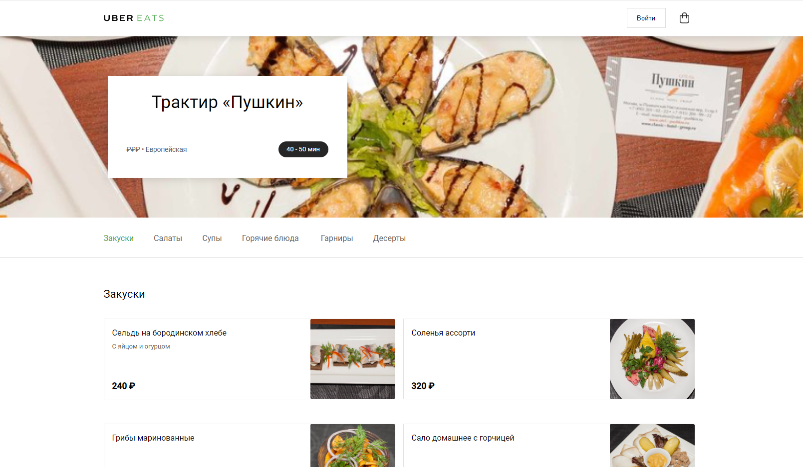

# Uber-eats
### Responsive on all devices Uber eats site example 
#### made with only html, css and flexboxgrid2 css framework. [Figma layout](https://www.figma.com/file/sO8htXzA6rPwTVwXuc5jW5/Uber-Eats-(Copy)?node-id=0%3A1) 
### url: [Uber eats example](https://cute-sunburst-1990ab.netlify.app)   

